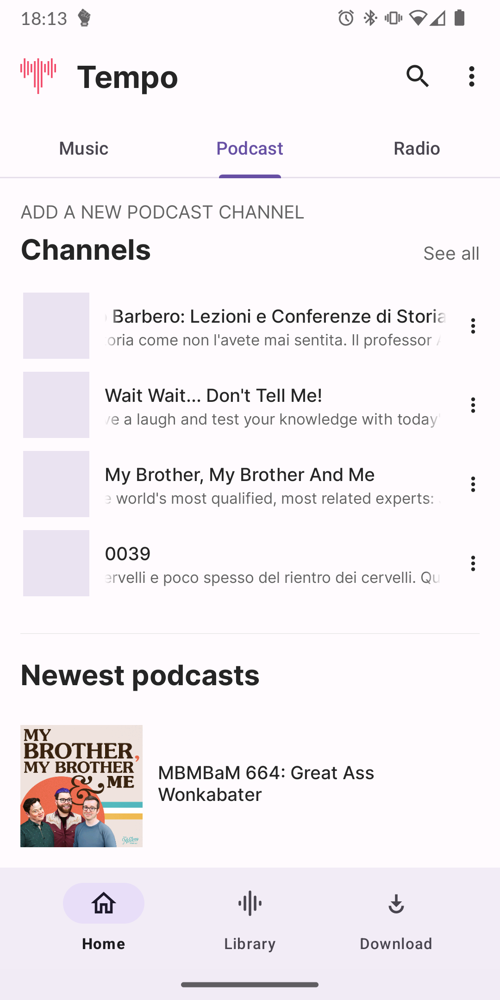
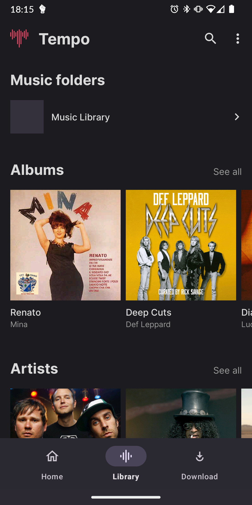
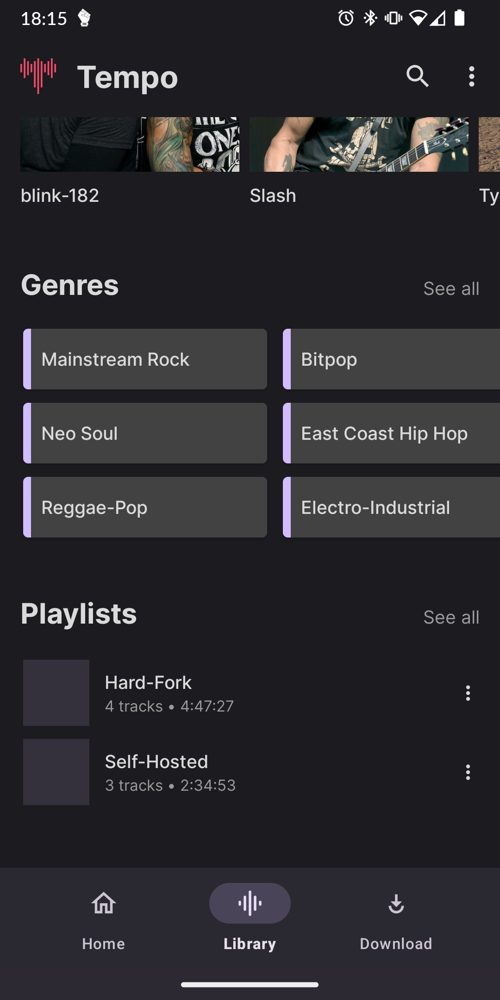

  

  <b>Access your music library on all your android devices</b>

    

<!-- 

    
    

 -->

**YuMusic** is an open-source and lightweight music client for Subsonic, designed and built natively for Android. It provides a seamless and intuitive music streaming experience, allowing you to access and play your Subsonic music library directly from your Android device. 

YuMusic does not rely on magic algorithms to decide what you should listen to. Instead, the interface is built around your listening history, randomness, and optionally integrates with services like Last.fm to personalize your music experience.

**If you find YuMusic useful, please consider starring the project on GitHub. It would mean a lot to me and help promote the app to a wider audience.**

**Use the Github version of the app for full Android Auto and Chromecast support.**

## About YuMusic

**YuMusic** is an independent Subsonic music client project, inspired by and based on the excellent work done in the **Tempo** project. This is a completely separate and unaffiliated project that builds upon the foundation established by the original creators.

### Project History & Credits

**Tempo** was originally created by [CappielloAntonio](https://github.com/CappielloAntonio/tempo) who built an amazing Subsonic client from the ground up. When the original repository became inactive, [eddyizm](https://github.com/eddyizm/tempo) created and maintained an active fork, keeping development moving forward with many important improvements.

**YuMusic** is now developed and maintained by **Yuri** ([isyuricunha](https://github.com/isyuricunha)) as an independent project. While inspired by Tempo's excellent foundation, YuMusic is a separate project with its own vision for modern music streaming experience.

**Credits & Acknowledgments:**
- **[CappielloAntonio](https://github.com/CappielloAntonio/tempo)** - Original Tempo creator and developer
- **[eddyizm](https://github.com/eddyizm/tempo)** - Tempo fork maintainer who kept the project thriving
- All contributors who helped improve the Tempo project over time

*YuMusic is released under the same GPL v3.0 license in respect to the original work and community.*

For detailed changes and updates, see [CHANGELOG.md](CHANGELOG.md).

> **Note**: YuMusic is an independent project. For the original Tempo project, visit [CappielloAntonio/tempo](https://github.com/CappielloAntonio/tempo). For the active Tempo fork, visit [eddyizm/tempo](https://github.com/eddyizm/tempo). 

## Usage

[Documentation](USAGE.md) (work in progress)

## Features
- **Subsonic Integration**: YuMusic seamlessly integrates with your Subsonic server, providing you with easy access to your entire music collection on the go.
- **Sleek and Intuitive UI**: Enjoy a clean and user-friendly interface designed to enhance your music listening experience, tailored to your preferences and listening history.
- **Browse and Search**: Easily navigate through your music library using various browsing and searching options, including artists, albums, genres, playlists, decades and more.
- **Streaming and Offline Mode**: Stream music directly from your Subsonic server. Offline mode is currently under active development and may have limitations when using multiple servers.
- **Playlist Management**: Create, edit, and manage playlists to curate your perfect music collection.
- **Gapless Playback**: Experience uninterrupted playback with gapless listening mode.
- **Chromecast Support**: Stream your music to Chromecast devices. The support is currently in a rudimentary state.
- **Scrobbling Integration**: Optionally integrate YuMusic with Last.fm to scrobble your played tracks, gather music insights, and further personalize your music recommendations, if supported by your Subsonic server.
- **Podcasts and Radio**: If your Subsonic server supports it, listen to podcasts and radio shows directly within YuMusic, expanding your audio entertainment options.
- **Transcoding Support**: Activate transcoding of tracks on your Subsonic server, allowing you to set a transcoding profile for optimized streaming directly from the app. This feature requires support from your Subsonic server.
- **Android Auto Support**: Enjoy your favorite music on the go with full Android Auto integration, allowing you to seamlessly control and listen to your tracks directly from your mobile device while driving.

## Support

YuMusic is an independent open-source project developed and maintained by Yuri. I would like to express my heartfelt thanks to all users who show their love and support for YuMusic. Your contributions and encouragement mean a lot and help drive the development and improvement of the app.

**Special recognition:**
- Thanks to the original Tempo creators for the excellent foundation
- Thanks to all Tempo contributors whose work inspired YuMusic

## Screenshot

  <b>Light theme</b>

    
    
    
    
    
    
    
    

 

  <b>Dark theme</b>

    
    
    
    
    
    
    
    

## License

YuMusic is released under the [GNU General Public License v3.0](LICENSE). Feel free to modify, distribute, and use the app in accordance with the terms of the license. Contributions to the project are also welcome. 
